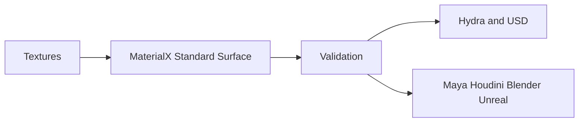

# dcc-materialx

<p align="center">
  
</p>

## Agent workflow

AI agents should use installed package skills through the shared gateway. IDE
users may continue to use the MCP endpoint.

```bash
dcc-mcp-cli dcc-types
dcc-mcp-cli list
dcc-mcp-cli search --query "<task>" --dcc-type <host>
dcc-mcp-cli describe <tool-slug>
dcc-mcp-cli call <tool-slug> --json '{"key":"value"}'
```

If the package skill is not active, call
`dcc-mcp-cli load-skill <skill-name> --dcc-type <host>`. After the task,
query `dcc-mcp-cli stats --range 24h --session-id <task-id>` and pass only
bounded evidence to the `review_skill_improvement` prompt from
`dcc-mcp-skills-creator`.


Portable MaterialX authoring and validation for look-development interchange
across Maya, Houdini, Blender, USD/Hydra, Unreal, and renderer pipelines.


## Included skill

`materialx-lookdev` creates a minimal Standard Surface material, validates `.mtlx`
documents, and lists their nodes. Host adapters remain responsible for import,
renderer translation, and scene assignment.

Install the official Python bindings in the adapter environment before loading:

```bash
pip install MaterialX
```


