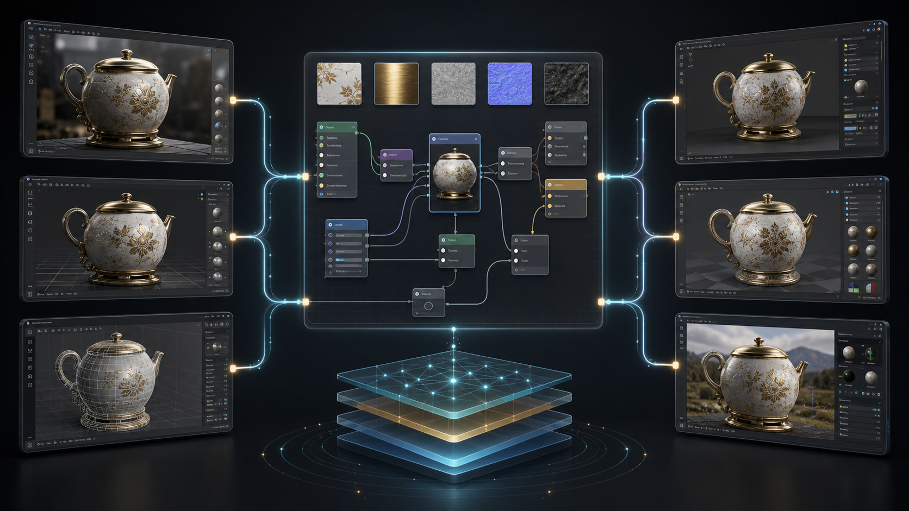
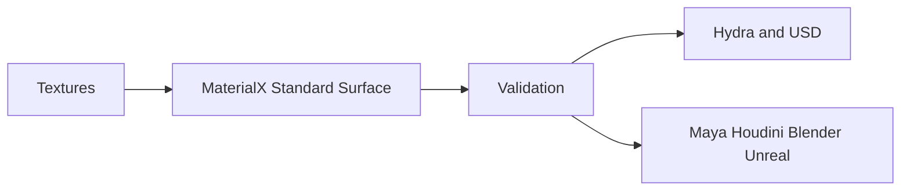

# dcc-materialx

Portable MaterialX authoring and validation for look-development interchange
across Maya, Houdini, Blender, USD/Hydra, Unreal, and renderer pipelines.



## Included skill

`materialx-lookdev` creates a minimal Standard Surface material, validates `.mtlx`
documents, and lists their nodes. Host adapters remain responsible for import,
renderer translation, and scene assignment.

Install the official Python bindings in the adapter environment before loading:

```bash
pip install MaterialX
```


