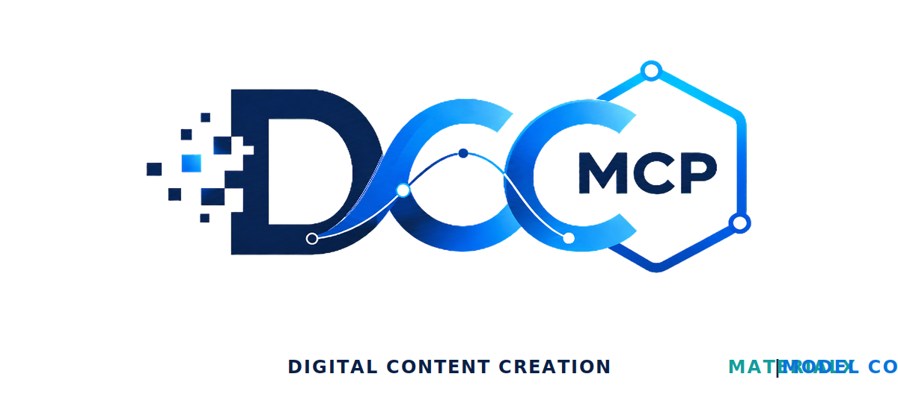
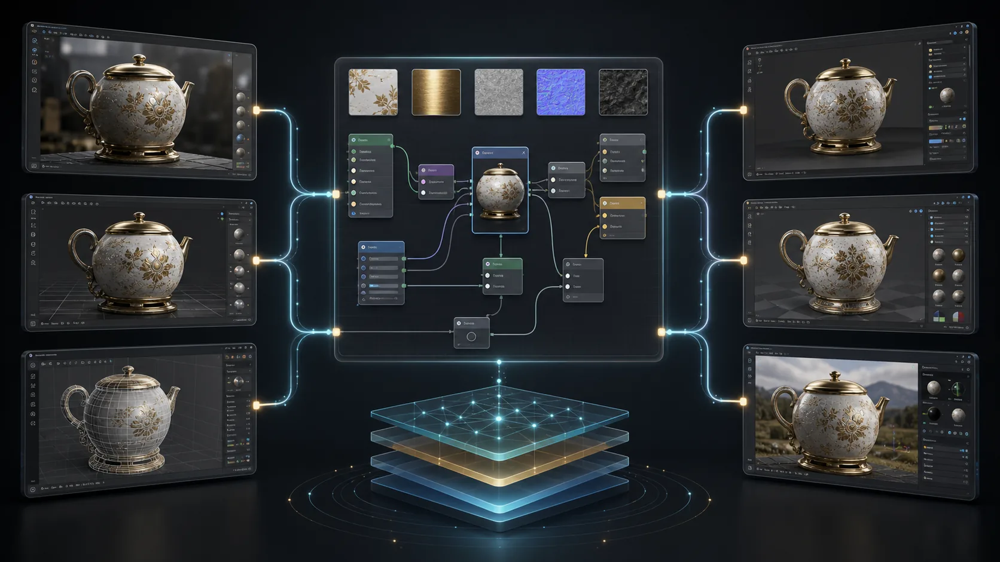
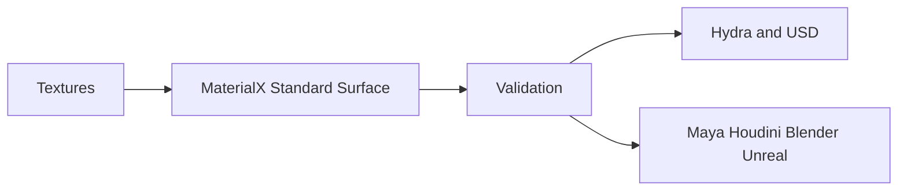

# dcc-materialx

<p align="center">
  
</p>

## Agent workflow

AI agents should use installed package skills through the shared gateway. IDE
users may continue to use the MCP endpoint.

### Install or update the CLI

`dcc-mcp-cli` is the preferred control path for every shell-capable agent. If
it is missing, ask the user before installing the latest official release:

```bash
# Linux/macOS
curl -fsSL https://raw.githubusercontent.com/dcc-mcp/dcc-mcp-core/main/scripts/install-cli.sh | sh

# Windows PowerShell
powershell -ExecutionPolicy Bypass -c "irm https://raw.githubusercontent.com/dcc-mcp/dcc-mcp-core/main/scripts/install-cli.ps1 | iex"
```

Keep an official build current through the release manifest:

```bash
dcc-mcp-cli update check
dcc-mcp-cli update apply
```

`update apply` downloads and stages the latest CLI for the next launch. It
does not update a running `dcc-mcp-server`; update that server in its own
environment.

```bash
dcc-mcp-cli dcc-types
dcc-mcp-cli list
dcc-mcp-cli search --query "<task>" --dcc-type <host>
dcc-mcp-cli describe <tool-slug>
dcc-mcp-cli call <tool-slug> --json '{"key":"value"}'
```

If the package skill is not active, call
`dcc-mcp-cli load-skill <skill-name> --dcc-type <host>`. After the task,
query `dcc-mcp-cli stats --range 24h --session-id <task-id>` and pass only
bounded evidence to the `review_skill_improvement` prompt from
`dcc-mcp-skills-creator`.


Portable MaterialX authoring and validation for look-development interchange
across Maya, Houdini, Blender, USD/Hydra, Unreal, and renderer pipelines.



## Included skill

`materialx-lookdev` creates a minimal Standard Surface material, validates `.mtlx`
documents, and lists their nodes. Host adapters remain responsible for import,
renderer translation, and scene assignment.

Install the official Python bindings in the adapter environment before loading:

```bash
pip install MaterialX
```


